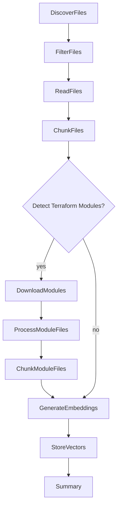

# Generate Embeddings Script

A Python script that uses Azure OpenAI to generate text embeddings for files in a directory and stores them in an S3 Vector bucket.


## Architecture
### Processing Flow



## Prerequisites

This script uses dependencies from the parent project's `pyproject.toml`.


## Configuration
### Required Environment Variables

Create a `.env` by copying `.env.example` and filling in your values:

- `AZURE_OPENAI_ENDPOINT` - Azure OpenAI endpoint URL
- `AZURE_OPENAI_API_KEY` - Azure OpenAI API key
- `AZURE_OPENAI_API_VERSION` - API version (e.g., "2023-05-15")
- `AZURE_OPENAI_EMBEDDINGS_MODEL` - Model name for embeddings
- `S3_VECTOR_BUCKET_NAME` - S3 Vector bucket name
- `S3_VECTOR_INDEX_NAME` - S3 Vector index name
- `S3_VECTOR_REGION` - AWS region for S3

### Optional Environment Variables

- `CHUNK_SIZE` - Maximum chunk size in characters (default: 1024)
- `CHUNK_OVERLAP` - Overlap between chunks (default: 100)
- `LOG_LEVEL` - Logging level: DEBUG, INFO, WARNING, ERROR (default: INFO)
- `INPUT_FOLDER` - Alternative to --input-folder argument


## Usage

### Basic Usage

Process all files in a directory:

```bash
uv run python scripts/generate_embeddings/main.py --input-folder /path/to/documents
```

### Dry Run (No S3 Uploads)

Test the processing without uploading:

```bash
uv run python scripts/generate_embeddings/main.py \
  --input-folder /path/to/documents \
  --dry-run
```

### Limit Files for Testing

Process only the first 10 files:

```bash
uv run python scripts/generate_embeddings/main.py \
  --input-folder /path/to/documents \
  --max-files 10
```

### Filter Files

Process only Python files:

```bash
uv run python scripts/generate_embeddings/main.py \
  --input-folder /path/to/documents \
  --include "*.py"
```

Exclude log files:

```bash
uv run python scripts/generate_embeddings/main.py \
  --input-folder /path/to/documents \
  --exclude "*.log"
```

### Combined Example

```bash
uv run python scripts/generate_embeddings/main.py \
  --input-folder /path/to/documents \
  --include "*.{py,md,txt}" \
  --exclude "**/node_modules/**" \
  --max-files 50 \
  --dry-run
```

## Command-Line Options

| Option | Description |
|--------|-------------|
| `--input-folder` | Path to the directory to process (required, or set INPUT_FOLDER env var) |
| `--dry-run` | Process files but skip S3 uploads |
| `--max-files N` | Process only the first N files (useful for testing) |
| `--include PATTERN` | Glob pattern to include files (e.g., `*.py`) |
| `--exclude PATTERN` | Glob pattern to exclude files (e.g., `*.log`) |

## Example Output

```
2024-10-06 12:00:00 - root - INFO - Starting embedding generation
2024-10-06 12:00:00 - root - INFO - Input folder: /path/to/code
2024-10-06 12:00:01 - root - INFO - Discovered 150 files
2024-10-06 12:00:01 - root - INFO - Filtered to 120 files for processing
2024-10-06 12:00:05 - root - INFO - Created 450 total chunks
2024-10-06 12:00:06 - root - INFO - Detected 3 unique Terraform modules
2024-10-06 12:00:08 - root - INFO - Downloaded 3 modules
2024-10-06 12:00:09 - root - INFO - Created 87 chunks from module files
2024-10-06 12:00:45 - root - INFO - Generated 537 embeddings (0 failures)
2024-10-06 12:00:50 - root - INFO - Stored 537 vectors (0 failures)
2024-10-06 12:00:50 - root - INFO - 
================================================================================
PROCESSING SUMMARY
================================================================================
Files discovered:        150
Files processed:         120
Files skipped:           30
Chunks created:          537
Vectors uploaded:        537
TF modules detected:     3
TF modules downloaded:   3
Failures:                0
================================================================================
```
